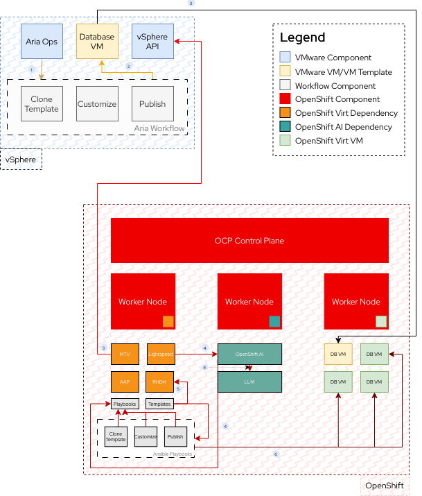

# vSphere to Virt for Application Development

This demo outlines how to cut across silos and accelerate application
development by migrating VMs and their vRA/Aria Automation/VCF-A workflows to Ansible and
OpenShift Virt and making self-service requests for developers easy with
Developer Hub.

## Three Key Points

- Use the **Migration Toolkit for Virtualization** to migrate virtual machines
  into OpenShift Virt from vSphere.
- Use **OpenShift AI** and **Ansible Lightspeed** to convert vRA/Aria
  Automation/VCF-A workflows and blueprints into Ansible playbooks with
  self-hosted models
- Use **Red Hat Developer Hub** to create applications and instances of
  virtualized components conformant with enterprise best practices and security
  guidelines.

## Architecture

## Setting Up

### What You'll Need

### Instructions

## Demo

### Scenario

You are a vSphere administrator that is, amongst other things, responsible for
the VM templates that deploy your organization's database.

This VM template is mature and highly optimized for your organization's needs.
Containerizing it is on the table but requires finesse and will take time.

The business has decided to move away from Broadcom, and fast. You need to move
this database but are interested in knowing how developers can create instances
of it alongside their containerized applciations.

### Migrate VM into OpenShift with the Migration Toolkit for VMs

### Convert VM Template Creation vRA Workflow to Ansible with AI Agents

### Create Self-Service Offering in Developer Hub
