# Red Hat Observability Demo

Easily observe your cluster and its workloads within the OpenShift Console and
your external tooling.

<!-- vim-markdown-toc GFM -->

* [Three Key Points](#three-key-points)
* [Architecture](#architecture)
    * [Metrics](#metrics)
    * [Logs](#logs)
    * [Traces](#traces)
* [Setting Up](#setting-up)
    * [What You'll Need](#what-youll-need)
    * [The Express Lane](#the-express-lane)
        * [Create AWS Resources](#create-aws-resources)
        * [Install the OpenShift GitOps operator](#install-the-openshift-gitops-operator)
        * [Create secrets](#create-secrets)
        * [Create GitOps Applications](#create-gitops-applications)
            * [Demo Operators](#demo-operators)
            * [Demo Resources](#demo-resources)
            * [Sample Applications](#sample-applications)
    * [The Scenic Route](#the-scenic-route)
        * [Install Operators](#install-operators)
        * [Enable Cluster Platform Monitoring](#enable-cluster-platform-monitoring)
        * [Create namespaces](#create-namespaces)
        * [Create service accounts](#create-service-accounts)
            * [OpenTelemetry Collector and Tempo](#opentelemetry-collector-and-tempo)
            * [LokiStack and Cluster Log Forwarder](#lokistack-and-cluster-log-forwarder)
        * [Install the OpenTelemetry Collector](#install-the-opentelemetry-collector)
        * [Install and Configure Vector and Loki](#install-and-configure-vector-and-loki)
        * [Install and configure cluster tracing](#install-and-configure-cluster-tracing)
        * [Deploy the sample app and enable auto instrumentation](#deploy-the-sample-app-and-enable-auto-instrumentation)
        * [Enable the load generator](#enable-the-load-generator)
        * [Install Streams for Apache Kafka and the Kafka Console](#install-streams-for-apache-kafka-and-the-kafka-console)
            * [Install the Kafka Cluster](#install-the-kafka-cluster)
            * [Install the Kafka Console](#install-the-kafka-console)
            * [Create the observability signal topics](#create-the-observability-signal-topics)
        * [Install Cluster Observability UI Plugins](#install-cluster-observability-ui-plugins)
* [Demo](#demo)
    * [Quickly observe cluster behavior with OpenShift Monitoring](#quickly-observe-cluster-behavior-with-openshift-monitoring)

<!-- vim-markdown-toc -->
## Three Key Points

- Observe cluster and workload behavior with minimal configuration with the
  **Red Hat Cluster Observability Operator (COO)**
- Aggregate and forward logs to your corporate log aggregators or SIEMs with the
  **Red Hat Cluster Logging Operator (CLO)**
- Send workload and cluster signals to your existing observability stack with
  the **Red Hat Build of OpenTelemetry**

## Architecture

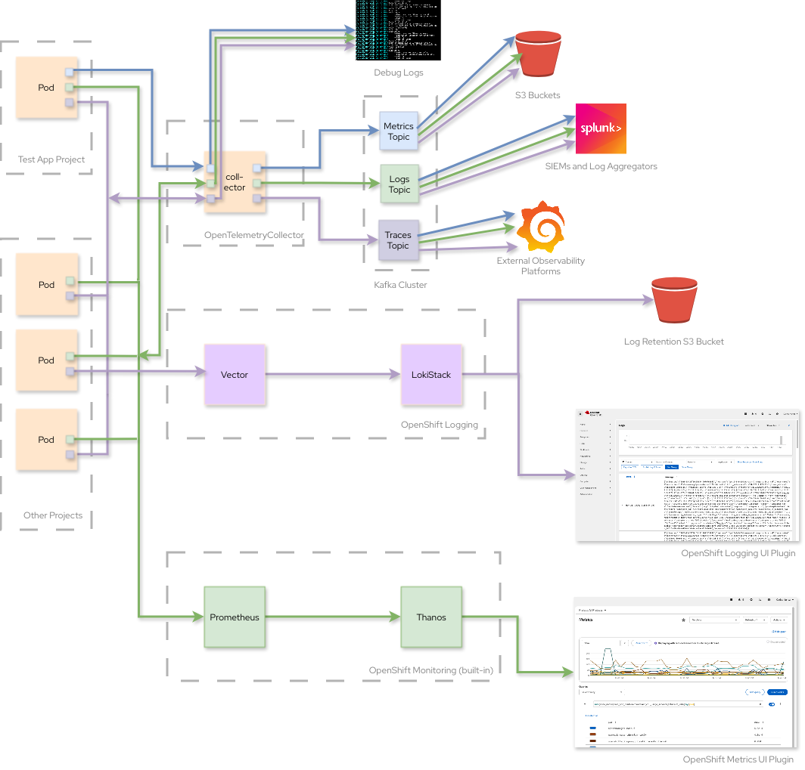

The resources provided in this demo create an end-to-end observability stack for
metrics, logs and traces on any OpenShift cluster.

### Metrics

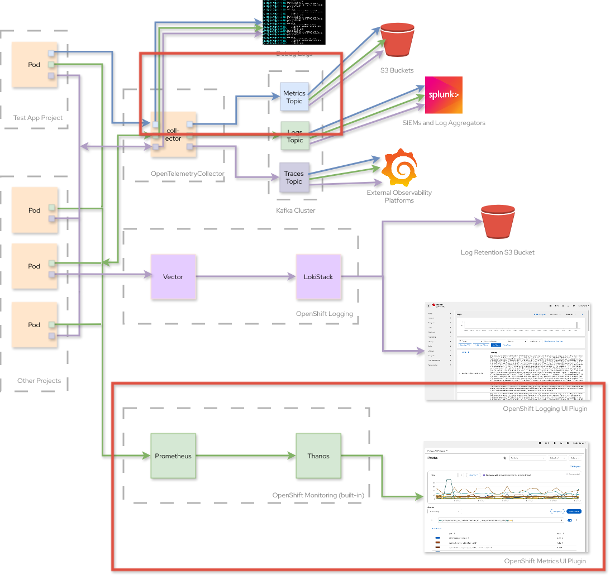

Metrics are captured for all workloads in the cluster and the OpenShift control
plane and worker nodes that host them. They are surfaced in two ways: by a
Prometheus instance managed by the built-in OpenShift Monitoring operator, and
by an OpenTelemetry collector managed by the operator for the Red Hat Build of
OpenTelemetry. The collector forwards metrics to a Kafka topic and to Perses for
external visualization.

This implementation makes it possible for cluster operators to quickly observe
cluster health in the **Observe** > **Metrics** pane within the OpenShift
Console, and for other engineers to query and dashboard the signals they care
about from a central observability platform, like Datadog, Grafana or Perses.

### Logs

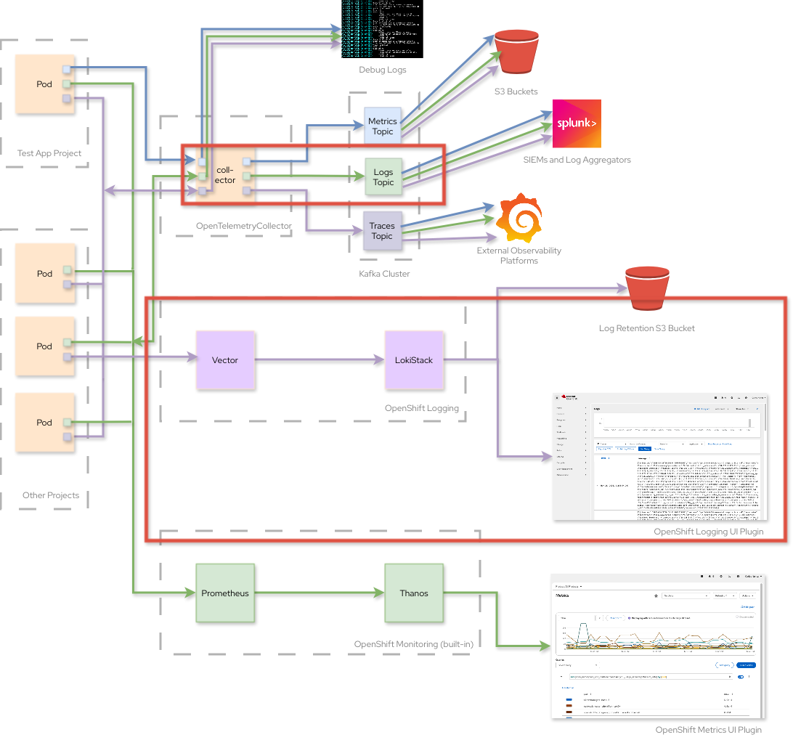

Like our metrics architecture, workload and cluster node logs are aggregated in
two ways: by a Vector instance managed by the **Cluster Logging Operator**
through a `ClusterLogForwarder` resource, and by the same OpenTelemetry
collector that collects metrics, as described in the previous section. The
OpenTelemetry collector forwards log entries to a Kafka tapic and to Perses.

Unlike the metrics design, the redundancy implemented here is only for
demonstration purposes. We recommend choosing only one of these options to
reduce CPU and network pressure on your cluster.

The **Red Hat Build of OpenTelemetry** is a good choice for those seeking to
centralize signal aggregation and forwarding, whereas the **Cluster Logging
Operator** is ideal for those who desire having dedicated collectors for
metrics, logs and traces.

### Traces

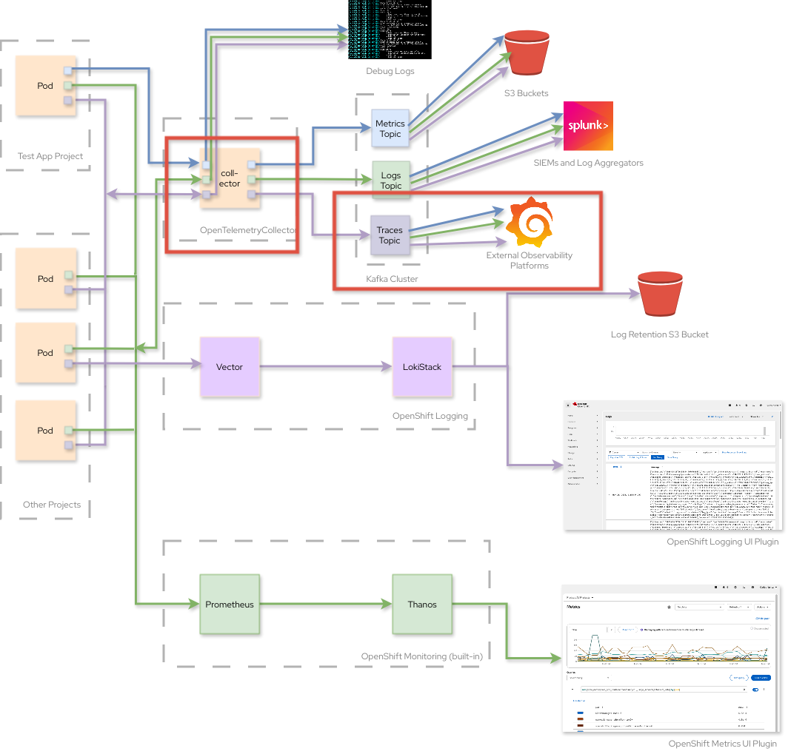

Traces are collected by OpenTelemetry and forwarded to a Tempo instance managed
by the **Cluster Observability Operator (COO)** and to Kafka as well as Perses.

Like metrics, Tempo and the OpenShift Console UI Plugin provided by COO provide
cluster operators with a quick glance at application behavior in the **Observe** > 
**Traces** pane.

This demo also provides an AI-generated Golang web server to show how tracing works
within OpenShift. Spans are generated by a human-generated script performing
random HTTP methods against the web server every second.

## Setting Up

### What You'll Need

- An AWS Account with an Access and Secret Key Pair
- The AWS CLI
- An OpenShift Cluster (tested with v4.20)
- Access to a shell, like `bash`, `zsh` or `fish`

> 📝 **NOTE**
>
> You have several options if you don't have an OpenShift cluster handy:
>
> - [OpenShift Local](https://developers.redhat.com/products/openshift-local) or
> - Stand up a Single-Node OpenShift cluster in about 45 minutes
>   with [Carlos's Demoland](https://github.com/carlosonunez-redhat/demoland).

### The Express Lane

#### Create AWS Resources

Run the CloudFormation script supplied this with this demo:

```sh
aws cloudformation create-stack \
  --capabilities CAPABILITY_NAMED_IAM \
  --stack-name rhobs-s3-demo \
  --template-body file:///./include/cloudformation/loki_s3_bucket.yaml 
```

This will:

- Create a bucket that Loki and Tempo will store logs and traces into,
  respectively, and
- Create an IAM user that is only allowed to read from and write into this
  bucket.

Run `aws cloudformation describe-stacks --stack-name rhobs-s3-demo` and wait for
it to achieve a `CREATE_COMPLETE` state.

Once it does, run the command below to get the name of the bucket and the user's
access and secret key pair:

```sh
data=$(aws cloudformation describe-stack-events --stack-name rhobs-s3-demo \
  --query 'Stacks[0].Outputs' \
  --output text)
bucket_name=$(echo "$data" | grep -E '^BucketName' | awk '{print $NF}')
ak=$(echo "$data" | grep -E '^AccessKey' | awk '{print $NF}')
sk=$(echo "$data" | grep -E '^SecretAccessKey' | awk '{print $NF}')
```

#### Install the OpenShift GitOps operator

Install the OpenShift GitOps operator from the **Ecosystem > Software Catalog** pane
using the defaults.

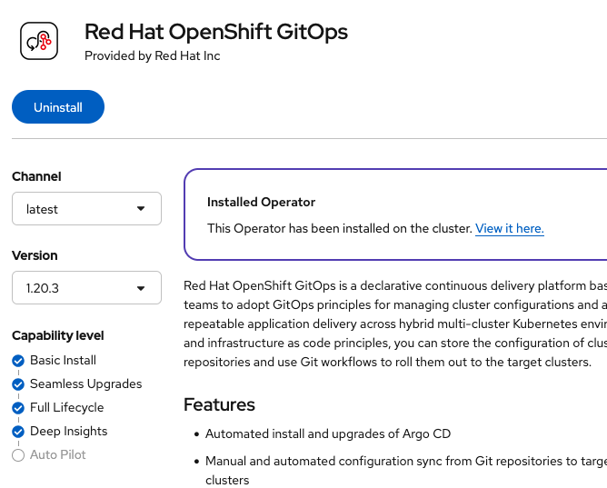
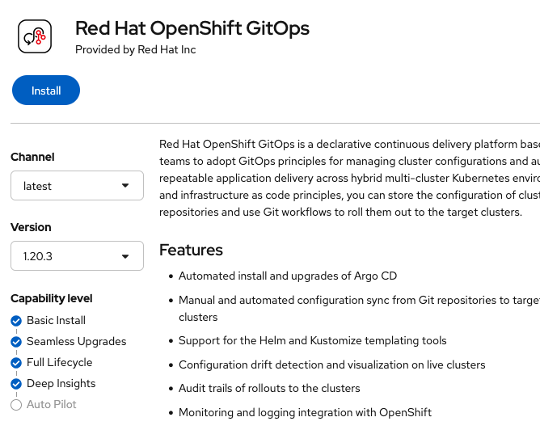

Once the installation is complete, run the commands below to create an
application that installs the operators and components used by this demo:

#### Create secrets

```sh
region=$(aws configure get region)
cat >/tmp/kustomization.yaml <<-EOF
resources:
- ../components/openshift-tracing/resources/tempo-stack/secret/s3
- ../components/openshift-logging/resources/loki-stack/secret/s3
patches:
  - target:
      kind: Secret
      name: tempostack-s3
      namespace: openshift-tracing
    patch: |-
      - op: replace
        path: /metadata/name
        value: rhobs-secret-s3
      - op: replace
        path: /metadata/namespace
        value: openshift-observability
      - op: replace
        path: /stringData/bucket
        value: rhobs-demo-bucket
      - op: replace
        path: /stringData/endpoint
        value: https://s3.$region.amazonaws.com
      - op: replace
        path: /stringData/access_key_id
        value: "$ak"
      - op: replace
        path: /stringData/access_key_secret
        value: "$sk"
  - target:
      kind: Secret
      name: logging-loki-s3
      namespace: openshift-logging
    patch: |-
      - op: replace
        path: /metadata/namespace
        value: openshift-logging
      - op: replace
        path: /stringData/bucketnames
        value: "$bucket_name"
      - op: replace
        path: /stringData/endpoint
        value: https://s3.$region.amazonaws.com
      - op: replace
        path: /stringData/access_key_id
        value: "$ak"
      - op: replace
        path: /stringData/access_key_secret
        value: "$sk"
EOF
oc apply -k /tmp
rm -r /tmp/kustomization.yaml
```

#### Create GitOps Applications

Next you'll create three GitOps Applications that will sync the demo resources in this
codebase with your cluster.

##### Demo Operators

```sh
# Remember to run `oc login` first before running the command(s) below
cat <<-EOF | oc apply -f -
apiVersion: argoproj.io/v1alpha1
kind: Application
metadata:
  name: rhobs-demo-operators
  namespace: openshift-gitops
spec:
  project: default
  destination:
    namespace: openshift-gitops
    server: https://kubernetes.default.svc
  source:
    repoURL: https://github.com/carlosonunez-redhat/demoland
    targetRevision: main
    path: ./environments/rhobs-demo/bootstrap/operators
  syncPolicy:
    automated:
      enabled: true
    syncOptions:
      - SkipDryRunOnMissingResources=true
EOF
```

##### Demo Resources

```sh
# Remember to run `oc login` first before running the command(s) below
cat <<-EOF | oc apply -f -
apiVersion: argoproj.io/v1alpha1
kind: Application
metadata:
  name: rhobs-demo-resources
  namespace: openshift-gitops
spec:
  project: default
  destination:
    namespace: openshift-gitops
    server: https://kubernetes.default.svc
  source:
    repoURL: https://github.com/carlosonunez-redhat/demoland
    targetRevision: main
    path: ./environments/rhobs-demo/bootstrap/resources
  syncPolicy:
    automated:
      enabled: true
    syncOptions:
      - SkipDryRunOnMissingResources=true
EOF
```

##### Sample Applications

```sh
# Remember to run `oc login` first before running the command(s) below
cat <<-EOF | oc apply -f -
apiVersion: argoproj.io/v1alpha1
kind: Application
metadata:
  name: rhobs-demo-apps
  namespace: openshift-gitops
spec:
  project: default
  destination:
    namespace: openshift-gitops
    server: https://kubernetes.default.svc
  source:
    repoURL: https://github.com/carlosonunez-redhat/demoland
    targetRevision: main
    path: ./environments/rhobs-demo/bootstrap/apps
  syncPolicy:
    automated:
      enabled: true
    syncOptions:
      - SkipDryRunOnMissingResources=true
EOF
```

The environment will be ready in about 15 minutes.

### The Scenic Route

#### Install Operators

The observability stack in this demo will take advantage of these operators:

- **Red Hat Cluster Observability Operator**: Installs a complete observability
  stack (logging, metrics, and tracing) with OpenShift Console UI plugins for
  local observability.
- **Red Hat Cluster Logging Operator (CLO)**: Installs
  [Vector](https://github.com/vectordotdev/vector), a high-performance metrics
  forwarder, and enables centralized configuration and customization.
- **Red Hat Build of OpenTelemetry (OTel)**: Provides high-performance,
  low-latency signal collection, transformation and export with
  enterprise-friendly defaults.

We will also use these operators to simulate external systems often found in
enterprise observability platforms:

- **Streams for Apache Kafka**: A Kubernetes-native platform for microservices
  communication with Kafka. We'll be focusing on Kafka primitives (mostly
  topics) in this demo.
- **Perses**: An open-source, CNCF-sponsored dashboard tool for metrics, logs and traces.

The installation process for all of these operators is the same. Repeat the
steps below for each of the operators on this list.

1. From the OpenShift console, click on **Ecosystem**, then on **Software
   Catalog** to view the list of operators available in your cluster.

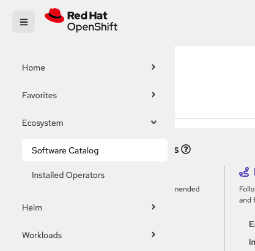

2. Search for the operator to install, then click on "Install." Review the
   defaults presented, then click on "Install" to complete the installation.

3. The OpenShift Console will notify you when the operator has been installed.


#### Enable Cluster Platform Monitoring

Every OpenShift cluster ships with the **OpenShift Monitoring operator**. This
operator installs cluster-wide Prometheus, Thanos and Alertmanager as well, a
default node exporter and some preconfigured alerts.

However, cluster monitoring is not enabled by default. To enable it, create a
special `ConfigMap` in the `openshift-monitoring` namespace called
`cluster-monitoring-config` with an empty `config.yaml` key in its `data` field.

```sh
oc apply -f - <<-EOF
apiVersion: v1
kind: ConfigMap
metadata:
  name: cluster-monitoring-config
  namespace: openshift-monitoring
data:
  config.yaml: ""
```

Wait a minute for the OpenShift Monitoring operator to apply the new
changes. Afterwards, visit the OpenShift console and click on **Observe** >
**Metrics**. Click on the dropdown underneath **Queries** and select **CPU
Usage**. A line graph of CPU usage for all workloads in the cluster should
appear along with a tabular outline of this data.


> 📝 **NOTE**
>
> The **Cluster Observability Operator** provides the
> **MonitoringStack** resource to configuring separate Prometheus instances to
> better isolate metrics by workload or application domain. This is out of scope
> for this demo, but you can learn more about this custom resource
> [here](https://docs.redhat.com/en/documentation/red_hat_openshift_cluster_observability_operator/1-latest/pdf/installing_red_hat_openshift_cluster_observability_operator/configuring-the-cluster-observability-operator-to-monitor-a-service#creating-a-monitoringstack-object-for-cluster-observability-operator_configuring_the_cluster_observability_operator_to_monitor_a_service).

#### Create namespaces

This environment uses three namespaces:

- **openshift-observability**: Hosts Tempo and the OpenTelemetry collector.
- **openshift-logging**: Hosts Loki and the ClusterLogForwarder that ships logs
  to Kafka, our external signals gathering system.
- **rhobs-messaging**: Hosts our "external" Kafka cluster.

Use `oc` to create them:

```sh
for ns in openshift-observability openshift-logging rhobs-messaging
do oc create ns "$ns"
done
```

Because our OpenTelemetryCollector will surface cluster metrics and node logs,
we will need to modify our `openshift-observability` namespace to allow
privileged pods. Use `oc` to do this as well:

```sh
oc annotate ns openshift-observability  \
  security.openshift.io/scc.podSecurityLabelSync="false" \
  pod-security.kubernetes.io/enforce="privileged" \
  pod-security.kubernetes.io/audit="privileged" \
  pod-security.kubernetes.io/warn="privileged"
```

#### Create service accounts

Next, we will create two service accounts:

- A service account that will enable the OpenTelemetry collector to collect
  cluster metrics, events and logs and publish traces to the cluster's Tempo
  instance, and
- A service account that enables Vector to retrieve cluster and workload logs
  through the ClusterLogForwarder.

##### OpenTelemetry Collector and Tempo

Create a `ServiceAccount` called `rhobs-sa`:

```sh
oc apply -f - <<-EOF
apiVersion: v1
kind: ServiceAccount
metadata:
  name: rhobs-sa
  namespace: openshift-observability
EOF
```

Next, use  a `ClusterRoleBinding` to allow this service account to create
privileged pods (required for surfacing node logs):

```sh
oc apply -f - <<-EOF
apiVersion: rbac.authorization.k8s.io/v1
kind: ClusterRoleBinding
metadata:
  name: rhobs-sa-allow-privileged
roleRef:
  apiGroup: rbac.authorization.k8s.io
  kind: ClusterRole
  name: system:openshift:scc:privileged
subjects:
- kind: ServiceAccount
  name: rhobs-sa
  namespace: openshift-observability
EOF
```

Next, create a `ClusterRole` to give this service account the ability to
retrieve Kubernetes resource information thorugh the Downward API, and create a
`ClusterRoleBinding` to assign this role to our service account:

```sh
oc apply -f - <<-EOF
apiVersion: rbac.authorization.k8s.io/v1
kind: ClusterRole
metadata:
  name: otel-collector
rules:
- apiGroups: ["*"]
  resources: ["*"]
  verbs:
  - get
  - list
  - watch
---
apiVersion: rbac.authorization.k8s.io/v1
kind: ClusterRoleBinding
metadata:
  name: rhobs-sa-assign-otel-collector-role
roleRef:
  apiGroup: rbac.authorization.k8s.io
  kind: ClusterRole
  name: otel-collector
subjects:
- kind: ServiceAccount
  name: rhobs-sa
  namespace: openshift-observability
EOF
```

Finally, we need to give `rhobs-sa` the ability to log into Tempo so that our
OpenTelemetry collector can forward traces into it. Repeat the process above to
create a `ClusterRole` and `ClusterRoleBinding` that enables this capability:

```sh
oc apply -f - <<-EOF
apiVersion: rbac.authorization.k8s.io/v1
kind: ClusterRole
metadata:
  name: tempo-allow-trace-write
rules:
- apiGroups:
  - 'tempo.grafana.com'
resources: 
  - cluster
resourceNames:
  - traces
verbs:
  - 'create' 
---
apiVersion: rbac.authorization.k8s.io/v1
kind: ClusterRoleBinding
metadata:
  name: rhobs-sa-assign-otel-collector-role
roleRef:
  apiGroup: rbac.authorization.k8s.io
  kind: ClusterRole
  name: tempo-allow-trace-write
subjects:
- kind: ServiceAccount
  name: rhobs-sa
  namespace: openshift-observability
EOF
```

##### LokiStack and Cluster Log Forwarder

Like we did for Tempo and OTel, start by creating a `ServiceAccount` for the Loki
instance that will hold our logs internally:

```sh
oc apply -f - <<-EOF
apiVersion: v1
kind: ServiceAccount
metadata:
  name: collector
  namespace: openshift-logging
EOF
```

The OpenShift Cluster Logging Operator will create Cluster Roles that enable
service accounts to obtain application, infrastructure and audit logs from our
cluster and persist them into Loki.

Create a `ClusterRoleBinding` to assign these roles to our `collector`
service account:

```sh
oc apply -f - <<-EOF
apiVersion: rbac.authorization.k8s.io/v1
kind: ClusterRoleBinding
metadata:
  name: collect-audit-logs
roleRef:
  apiGroup: rbac.authorization.k8s.io
  kind: ClusterRole
  name: collect-audit-logs
subjects:
- kind: ServiceAccount
  name: collector
  namespace: openshift-logging
---
apiVersion: rbac.authorization.k8s.io/v1
kind: ClusterRoleBinding
metadata:
  name: collect-infrastructure-logs
roleRef:
  apiGroup: rbac.authorization.k8s.io
  kind: ClusterRole
  name: collect-infrastructure-logs
subjects:
- kind: ServiceAccount
  name: collector
  namespace: openshift-logging
---
apiVersion: rbac.authorization.k8s.io/v1
kind: ClusterRoleBinding
metadata:
  name: collect-application-logs
roleRef:
  apiGroup: rbac.authorization.k8s.io
  kind: ClusterRole
  name: collect-application-logs
subjects:
- kind: ServiceAccount
  name: collector
  namespace: openshift-logging
---
apiVersion: rbac.authorization.k8s.io/v1
kind: ClusterRoleBinding
metadata:
  name: logging-collector-logs-writer
roleRef:
  apiGroup: rbac.authorization.k8s.io
  kind: ClusterRole
  name: logging-collector-logs-writer
subjects:
- kind: ServiceAccount
  name: collector
  namespace: openshift-logging
EOF
```

#### Install the OpenTelemetry Collector

We're now ready to create the OpenTelemetry collector for our cluster. Execute
the `oc` command below to create it:

```sh
oc apply -f - <<-EOF
apiVersion: opentelemetry.io/v1beta1
kind: OpenTelemetryCollector
metadata:
  name: otel
  namespace: openshift-observability
spec:
  serviceAccount: rhobs-sa
  mode: daemonset
  securityContext:
    allowPrivilegeEscalation: false
    capabilities:
      drop:
      - CHOWN
      - DAC_OVERRIDE
      - FOWNER
      - FSETID
      - KILL
      - NET_BIND_SERVICE
      - SETGID
      - SETPCAP
      - SETUID
    readOnlyRootFilesystem: true
    seLinuxOptions:
      type: spc_t
    seccompProfile:
      type: RuntimeDefault  
  volumeMounts:
    - mountPath: /hostfs
      name: host
      readOnly: true      
    - name: journal-logs
      mountPath: /var/log/journal/
      readOnly: true      
  volumes:
    - hostPath:
        path: /
      name: host     
    - name: journal-logs
      hostPath:
        path: /var/log/journal         
  config:
    extensions:
      bearertokenauth:
        filename: /var/run/secrets/kubernetes.io/serviceaccount/token
    receivers:
      otlp:
        protocols:
          grpc: {}
          http: {}
      hostmetrics:
        collection_interval: 60s
        initial_delay: 1s
        root_path: /
        scrapers: 
          cpu: {}
          memory: {}
          disk: {}
          load: {}
          filesystem: {}
          paging: {}
          processes: {}
          process: {}    
      k8sobjects:
        auth_type: serviceAccount
        objects:
          - name: pods
            mode: pull 
            interval: 60s
          - name: events
            mode: watch
      kubeletstats:
        collection_interval: 60s
        auth_type: "serviceAccount"
        endpoint: "https://${env:K8S_NODE_NAME}:10250"
        insecure_skip_verify: true
      k8s_cluster:
        distribution: openshift
        collection_interval: 60s        
      journald:
        files: /var/log/journal/*/*
        priority: info 
        units:
          - kubelet
          - crio
          - init.scope
          - dnsmasq
        all: true
        retry_on_failure:
          enabled: true
          initial_interval: 1s
          max_interval: 60s
          max_elapsed_time: 5m
      k8s_events: {}
    processors:
      k8sattributes:
        auth_type: serviceAccount
        extract:
          metadata:
            - k8s.pod.name
            - k8s.pod.uid
            - k8s.deployment.name
            - k8s.namespace.name
            - k8s.node.name
            - k8s.pod.start_time
        pod_association:
          - sources:
              - from: resource_attribute
                name: k8s.pod.ip
          - sources:
              - from: resource_attribute
                name: k8s.pod.uid
          - sources:
              - from: connection  
    exporters:
      debug:
        verbosity: detailed
      otlp_http/tempo:
        endpoint: https://tempo-cluster-gateway.openshift-observability.svc.cluster.local:8080/api/traces/v1/cluster
        auth:
          authenticator: bearertokenauth
        tls:
          ca_file: /var/run/secrets/kubernetes.io/serviceaccount/service-ca.crt
          insecure: false
          reload_interval: 5s
      kafka/metrics:
        brokers:
        - kafka-cluster-kafka-brokers.rhobs-messaging.svc.cluster.local:9092
        protocol_version: 2.00
        topic: metrics-topic
        metrics:
          encoding: otlp_json
      kafka/logs:
        brokers:
        - kafka-cluster-kafka-brokers.rhobs-messaging.svc.cluster.local:9092
        protocol_version: 2.00
        topic: logs-topic
        logs:
          encoding: otlp_json
      kafka/traces:
        brokers:
        - kafka-cluster-kafka-brokers.rhobs-messaging.svc.cluster.local:9092
        protocol_version: 2.00
        topic: traces-topic
        traces:
          encoding: otlp_json
    service:
      extensions:
      - bearertokenauth
      pipelines:
        traces:
          receivers:
            - otlp
          processors: []
          exporters:
            - debug
            - otlp_http/tempo
            - kafka/traces
        logs:
          receivers:
            - k8sobjects
            - journald
            - k8s_events
            - k8s_cluster
          processors:
            - k8sattributes
          exporters:
            - debug
            - kafka/logs
        metrics:
          receivers:
            - hostmetrics
            - kubeletstats
            - k8s_cluster
          processors:
            - k8sattributes
          exporters:
            - debug
            - kafka/metrics
  env:
    - name: K8S_NODE_NAME
      valueFrom:
        fieldRef:
          fieldPath: spec.nodeName
```

This will create a cluster-wide collector with the following pipelines:

- **Metrics**: Host metrics (CPU, memory, etc) along with Kubernetes cluster and
  Kubelet signals will be enriched with Pod associations and sent to the stdout
  channel of the container running the OpenTelemetry collector process (via the
  `debug` exporter) and to the `metrics-topic` Kafka topic that we will set up
  shortly.
- **Logs**: systemd journal logs (useful for debugging OpenShift node issues),
  Kubernetes logs and Kubernetes events will be sent to the stdout
  channel of the container running the OpenTelemetry collector process (via the
  `debug` exporter) and to the `logs-topic` Kafka topic that we will set up
  shortly.
- **Traces**: An `otlp` compatible HTTP listener will receive spans and send
  them to three places:
  - The stdout channel of the container running the OpenTelemetry collector
    process (via the `debug` exporter), 
  - The `traces-topic` Kafka topic that we will set up soon, and
  - A Tempo instance that we will create soon.

After applying this resource, run `oc logs -n openshift-observability
daemonset/collector` to see the collector receive, enrich and route signals.

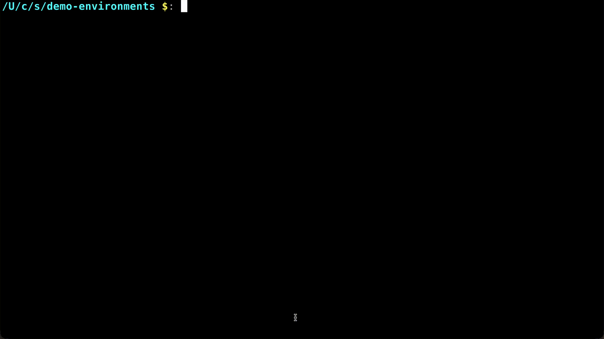

You'll also see errors from the collector trying to export signals to Tempo and
Kafka. This is expected, as we haven't set those up yet!

#### Install and Configure Vector and Loki

We're now going to install the OpenShift Cluster Logging Operator and configure
Vector to send cluster and workload logs to Loki and S3.

While this duplicates log aggregation capabilities built into OpenTelemetry,
CLO enables logs to be seen locally within the OpenShift Console and correlated
to Pods with the Signal Correlation feature provided by the Cluster
Observability Operator.

Run the `oc` command below to deploy a `LokiStack` that will deploy and
configure a local Loki instance:

```sh
oc apply -f - <<-EOF
apiVersion: loki.grafana.com/v1
kind: LokiStack
metadata:
  name: logging-loki
  namespace: openshift-logging
spec:
  managementState: Managed
  limits:
    global:
      retention:
        days: 30
  size: 1x.small
  storage:
    schemas:
      - version: v13
        effectiveDate: "2026-02-04" # needs to be set to two months before install date
    secret:
      name: logging-loki-s3
      type: s3
  storageClassName: gp3-csi
  tenants:
    mode: openshift-logging
EOF
```

> 📝 **NOTE**
>
> Change `1x.small` to `1x.pico` if you are deploying the LokiStack into an
> OpenShift cluster with less than 12 CPUs/vCPUs and 32GB RAM.

Run `oc describe lokistack logging-loki -n openshift-logging` to monitor the
installation. The LokiStack is ready when the `ReadyComponents` status becomes
`True`.

Next, run the `oc` command below to create a `ClusterLogForwarder` resource that
will configure Vector to send logs to the Loki instance we deployed earlier:

```sh
oc apply -f - <<-EOF
apiVersion: observability.openshift.io/v1
kind: ClusterLogForwarder
metadata:
  name: collector
  namespace: openshift-logging
spec:
  serviceAccount:
    name: collector
  pipelines:
    - name: all-to-lokistack
      inputRefs:
        - application
        - infrastructure
        - audit
      outputRefs:
        - default
  outputs:
    - name: default
      type: lokiStack
      lokiStack:
        authentication:
          token:
            from: serviceAccount
        target:
          name: logging-loki
          namespace: openshift-logging
      tls:
        ca:
          key: service-ca.crt
          configMapName: openshift-service-ca.crt
EOF
```

Run `oc describe clf collector  -n openshift-logging` to monitor the
installation. Log forwarding is ready when the `Ready` status becomes
`True`.

Confirm that Vector is sending logs to Loki by running `oc logs -n
openshift-logging statefulset/logging-loki-ingester`. You should see several
entries containing "flushing stream" if all is working properly.

#### Install and configure cluster tracing

Our cluster is now collecting metrics and logs, so it's time to enable cluster
tracing.

Traces are helpful to observe application behavior at transaction-level
granularity, such as the life of a request made to a web application or Pods and
Services reached by a packet flowing through a service mesh.

We will provision a sample application in the next section that uses
OpenTelemetry auto-instrumentation to generate spans for requests made to an
AI-generated web server. For now, we will configure the Tempo instance that our
OpenTelemetry collector is attempting to send traces to.

Run the `oc` command below to do that:

```sh
oc apply -f - <<-EOF
apiVersion: tempo.grafana.com/v1alpha1
kind: TempoStack
metadata:
  name: cluster
  namespace: openshift-observability
spec:
  managementState: Managed
  storage:
    secret:
      name: rhobs-secret-s3
      type: s3
  storageSize: 10Gi
  serviceAccount: rhobs-secret-s3
  tenants:
    mode: openshift
    authentication:
      - tenantName: cluster
        tenantId: "1610b0c3-c509-4592-a256-a1871353dbfa"
  template:
    gateway:
      enabled: true
    queryFrontend:
      jaegerQuery:
        enabled: true
EOF
```

Run `oc describe tempostack cluster  -n openshift-observability` to monitor the
installation. Cluster tracing is ready when the `Ready` status becomes
`True`.

#### Deploy the sample app and enable auto instrumentation

First, use the `oc` command below to configure OpenShift tracing to
automatically instrument Golang applications:

```sh
oc apply -f - <<-EOF
apiVersion: opentelemetry.io/v1alpha1
kind: Instrumentation
metadata:
  name: instrumentation
  namespace: openshift-observability
spec:
  exporter:
    endpoint: http://otel-collector.openshift-observability.svc.cluster.local:4318
  env:
    - name: OTEL_EXPORTER_OTLP_TIMEOUT
      value: "20"
    - name: OTEL_GO_AUTO_TARGET_EXE
      value: /opt/app-root/gobinary
  propagators:
    - tracecontext
    - baggage
  sampler:
    type: parentbased_traceidratio
    argument: "1"
EOF
```

Next, create the OpenShift project that will hold our example application:

```sh
oc apply -f - <<-EOF
apiVersion: v1
kind: Namespace
metadata:
  name: example-apps
  annotations:
      security.openshift.io/scc.podSecurityLabelSync: "false"
      pod-security.kubernetes.io/enforce: "privileged"
      pod-security.kubernetes.io/audit: "privileged"
      pod-security.kubernetes.io/warn: "privileged"
EOF
```

Next, create a Service Account that is able to start privileged Pods. The
sidecar that OpenTelemetry deploys to enable auto-instrumentation uses eBPF to
sample application behavior and generate spans. This requires a privileged
container in order to work.

```sh
oc apply -f - <<-EOF
apiVersion: v1
kind: ServiceAccount
metadata:
  name: simple-load-tester-sa
  namespace: example-apps
---
apiVersion: rbac.authorization.k8s.io/v1
kind: ClusterRoleBinding
metadata:
  name: simple-load-tester-sa-binding
roleRef:
  apiGroup: rbac.authorization.k8s.io
  kind: ClusterRole
  name: system:openshift:scc:privileged
subjects:
- kind: ServiceAccount
  name: simple-load-tester-sa
  namespace: example-apps
EOF
```

Finally, use the `oc` command below to deploy the AI-generated web server accompanying
this demo.

```sh
cluster_domain=$(oc get route -n openshift-console console -o jsonpath='{.status.ingress[0].host}' |
    sed 's;console-openshift-console.;;')
oc apply -f - <<-EOF
---
apiVersion: image.openshift.io/v1
kind: ImageStream
metadata:
  name: simple-load-tester-web-server
  namespace: exam
  labels:
    app: simple-load-tester
    component: web-server
spec:
  lookupPolicy:
    local: true
---
apiVersion: build.openshift.io/v1
kind: BuildConfig
metadata:
  name: simple-load-tester-web-server
  namespace: example-apps
  labels:
    app: simple-load-tester
    component: web-server
spec:
  source:
    git:
      uri: https://github.com/carlosonunez-redhat/demoland
      ref: main
    contextDir: apps/example-apps/simple-load-tester/web-server/src
  strategy:
    sourceStrategy:
      from:
        kind: DockerImage
        name: registry.access.redhat.com/ubi9/go-toolset:1.19
  output:
    to:
      kind: ImageStreamTag
      name: simple-load-tester-web-server:latest
  triggers:
    - type: ConfigChange
---
apiVersion: apps/v1
kind: Deployment
metadata:
  labels:
    app: simple-load-tester
    component: web-server
  name: simple-load-tester-web-server
  namespace: example-apps
  annotations:
    alpha.image.policy.openshift.io/resolve-names: '*'
    image.openshift.io/triggers: |-
      [
        {
          "from": {
            "kind": "ImageStreamTag",
            "name": "simple-load-tester-web-server"
          },
          "fieldPath": "spec.template.spec.containers[?(@.name==\"app\")].image"
        }
      ]
spec:
  replicas: 1
  selector:
    matchLabels:
      app: simple-load-tester
      component: web-server
  strategy: {}
  template:
    metadata:
      labels:
        app: simple-load-tester
        component: web-server
    spec:
      containers:
        - image: image-registry.openshift-image-registry.svc:5000/example-apps/simple-load-tester-web-server:latest
          name: app
          ports:
          - containerPort: 8000
          resources: {}
status: {}
---
apiVersion: v1
kind: Service
metadata:
  labels:
    app: simple-load-tester
    component: web-server
  name: simple-load-tester-web-server
spec:
  ports:
  - name: 8080-80
    port: 8080
    protocol: TCP
    targetPort: 8000
  selector:
    app: simple-load-tester
    component: web-server
  type: ClusterIP
---
apiVersion: route.openshift.io/v1
kind: Route
metadata:
  name: simple-load-tester-web-server
spec:
  host: web-server.$cluster_domain
  port:
    targetPort: 8000
  to:
    kind: Service
    name: simple-load-tester-web-server
EOF
```

> 📝 **NOTE**
>
> This is also an example of how to run applications on OpenShift directly
> from source code! Learn more about this capability
> [here](https://docs.redhat.com/en/documentation/openshift_container_platform/4.20/html/builds_using_buildconfig/understanding-image-builds).

The example app should be available at https://web-server.$YOUR_CLUSTER_DOMAIN
in a few minutes. It will look like the image shown below.

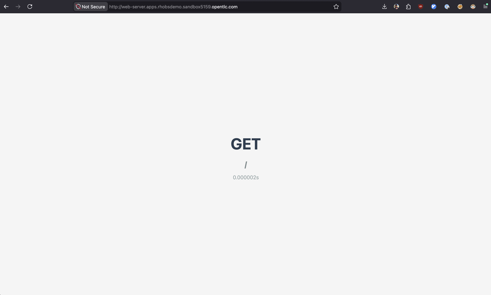

You should also see the log lines below after running `oc logs -n example-apps
deployment/simple-load-tester-web-server --container
opentelemetry-auto-instrumentation` that verifies that instrumentation was
automatically wired with the application:

```json
{"time":"2026-05-29T21:34:45.62496166Z","level":"INFO","source":{"function":"main.(*ProcessPoller).Poll","file":"/usr/src/go.opentelemetry.io/auto/cli/process_poller.go","line":69},"msg":"Polling for process","binary":"/opt/app-root/gobinary","interval":2000000000}
{"time":"2026-05-29T21:34:47.625196849Z","level":"INFO","source":{"function":"main.(*ProcessPoller).Poll","file":"/usr/src/go.opentelemetry.io/auto/cli/process_poller.go","line":92},"msg":"process found","PID":2}
{"time":"2026-05-29T21:34:47.62525957Z","level":"INFO","source":{"function":"main.main","file":"/usr/src/go.opentelemetry.io/auto/cli/main.go","line":138},"msg":"building OpenTelemetry Go instrumentation ...","version":{"Release":"v0.23.0","Revision":"unknown","Go":{"Version":"go1.25.1","OS":"linux","Arch":"amd64"}}}
{"time":"2026-05-29T21:34:47.625483216Z","level":"INFO","source":{"function":"main.main","file":"/usr/src/go.opentelemetry.io/auto/cli/main.go","line":161},"msg":"building OpenTelemetry Go instrumentation ...","PID":2,"version":{"Release":"v0.23.0","Revision":"unknown","Go":{"Version":"go1.25.1","OS":"linux","Arch":"amd64"}}}
{"time":"2026-05-29T21:34:47.627206268Z","level":"INFO","source":{"function":"go.opentelemetry.io/auto/internal/pkg/instrumentation.NewManager","file":"/usr/src/go.opentelemetry.io/auto/internal/pkg/instrumentation/manager.go","line":91},"msg":"loaded process info","process":{"ID":2,"Functions":[{"Name":"net/textproto.(*Reader).readContinuedLineSlice","Offset":2753632,"ReturnOffsets":[2753931,2753952,2753975,2754028,2754812,2755084]},{"Name":"net/http.Header.writeSubset","Offset":3027104,"ReturnOffsets":[3027392,3028724]},{"Name":"net/http.serverHandler.ServeHTTP","Offset":3100928,"ReturnOffsets":[3101753,3101794]}],"GoVersion":"1.19.13","Modules":{"github.com/sirupsen/logrus":"1.9.3","golang.org/x/sys":"0.0.0-20220715151400-c0bba94af5f8","std":"1.19.13"}}}
```

#### Enable the load generator

Use the `oc` command below to add a load generator component to the example web
server. This will issue random `GET` or `POST` HTTP methods to the web server
every second:

```sh
oc apply -f - <<-EOF
apiVersion: v1
kind: ConfigMap
metadata:
  name: app-config
  namespace: exmaple-apps
data:
  web_server_host: simple-load-tester-web-server.example-apps
---
apiVersion: apps/v1
kind: Deployment
metadata:
  labels:
    app: simple-load-tester
    component: load-generator
  name: simple-load-tester-load-generator
  namespace: example-apps
spec:
  replicas: 1
  selector:
    matchLabels:
      app: simple-load-tester
      component: load-generator
  strategy: {}
  template:
    metadata:
      labels:
        app: simple-load-tester
        component: load-generator
    spec:
      initContainers:
        - image: quay.io/fedora/fedora:43
          name: wait-for-web-server
          env:
            - name: WEB_SERVER_HOST
              valueFrom:
                configMapKeyRef:
                  name: app-config
                  key: web_server_host
          command:
            - sh
            - -c
            - |-
              >&2 echo "Waiting 180s for web server to become available at http://$WEB_SERVER_HOST:8080";
              timeout 180s sh -c 'while true; do curl -sS http://$WEB_SERVER_HOST:8080 && exit 0; sleep 1; done'
      containers:
        - image: quay.io/fedora/fedora:43
          name: container
          env:
            - name: WEB_SERVER_HOST
              valueFrom:
                configMapKeyRef:
                  name: app-config
                  key: web_server_host
          command:
            - bash
            - -c
            - |-
              >&2 echo "load-generator has started. Press CTRL-C to stop."
              attempts=0
              iterations=0
              while true
              do
                >&2 echo "---> iteration $((attempts+1))"
                nonce=$((RANDOM % 100))
                test "$(( nonce % 3 ))" -eq 0 && curl -o /dev/null -sS -v "http://$WEB_SERVER_HOST:8080" && continue
                >&2 echo "DEBUG: Payload: $payload"
                curl -v -sS "http://$WEB_SERVER_HOST:8080" --json "$payload"
                sleep $((RANDOM % 3))
                attempts=$((attempts+1))
              done
EOF
```

Run `oc logs -n example-apps deployment simple-load-tester-web-server
--container app` to confirm that the web server is receiving requests:

```text
time="2026-05-29T21:34:43Z" level=info msg="Starting server on :8000"
time="2026-05-29T21:34:46Z" level=info msg="Request handled" elapsed="1.541µs" method=GET path=/
time="2026-05-29T21:34:46Z" level=info msg="Request handled" elapsed="1.197µs" method=GET path=/
time="2026-05-29T21:34:46Z" level=info msg="Request handled" elapsed=890ns method=GET path=/
time="2026-05-29T21:34:46Z" level=info msg="Request handled" elapsed="1.111µs" method=POST path=/
time="2026-05-29T21:34:46Z" level=info msg="Request handled" elapsed="1.621µs" method=POST path=/
time="2026-05-29T21:34:46Z" level=info msg="Request handled" elapsed="1.258µs" method=POST path=/
time="2026-05-29T21:34:47Z" level=info msg="Request handled" elapsed="1.713µs" method=POST path=/
time="2026-05-29T21:34:48Z" level=info msg="Request handled" elapsed="1.68µs" method=POST path=/
time="2026-05-29T21:34:48Z" level=info msg="Request handled" elapsed="1.283µs" method=POST path=/
```

Afterwards, run `oc logs -n openshift-observability daemonset/collector` to
confirm that spans from the instrumentation sidecar are being sent to the
OpenTelemetry collector.

```text
oc logs -n openshift-observability -l app.kubernetes.io/component=opentelemetry-collector -f | grep -E 'Trace ID.*[a-zA-Z0-9].*'
```

You should see traces with Trace IDs like shown below:

```text
Trace ID       : 282f46893b4bc908ff14e9315e1719a8
Trace ID       : 118ecd7425c3ec85715cade70282ba2e
Trace ID       : c6b4ab395c3ce60d86a2a41e7f5996e7
Trace ID       : ee3e6662790c08657f321817d006f009
Trace ID       : c7c06c465733fd208c44660644032818
Trace ID       : 68267a42c7df80b198899316978d97b3
Trace ID       : 37ffb77d7255039da3327b33ed928f9b
Trace ID       : 36fd95c9d53315d170a754da108d7d16
Trace ID       : 1f754f2a44deece4f45de939bd304d22
Trace ID       : f02b07ebe6cb58eeeb573dafc646e5be
Trace ID       : a12bc3baf87e5d30ee3c8ddaf03c05f5
Trace ID       : d755bf6719fc88b0017195ea320d2ebe
```

#### Install Streams for Apache Kafka and the Kafka Console

Now that our cluster is collecting all of the key observability signals we'll
need, let's install and configure a Kafka cluster with the topics that
OpenTelemetry is attempting to send data to.

##### Install the Kafka Cluster

First, install the Kafka cluster:

```sh
oc apply -f - <<-EOF
apiVersion: kafka.strimzi.io/v1
kind: Kafka
metadata:
  name: kafka-cluster
spec:
  kafka:
    version: 4.2.0
    metadataVersion: 4.2-IV1
    listeners:
      - name: plain
        port: 9092
        type: internal
        tls: false
      - name: tls
        port: 9093
        type: internal
        tls: true
      - name: listener1
        port: 9094
        type: route
        tls: true
    config:
      offsets.topic.replication.factor: 1
      transaction.state.log.replication.factor: 1
      transaction.state.log.min.isr: 1
      default.replication.factor: 1
      min.insync.replicas: 1
  entityOperator:
    topicOperator: {}
    userOperator: {}
---
apiVersion: kafka.strimzi.io/v1
kind: KafkaNodePool
metadata:
  name: kafka-node-pool
  namespace: rhobs-messaging
  labels:
    strimzi.io/cluster: kafka-cluster
spec:
  replicas: 1
  roles:
    - controller
    - broker
  storage:
    type: jbod
    volumes:
      - id: 0
        type: persistent-claim
        size: 100Gi
        kraftMetadata: shared
EOF
```

Run `oc describe kafka kafka-cluster  -n rhobs-messaging` to monitor the
installation. Log forwarding is ready when the `Ready` status becomes
`True`.

##### Install the Kafka Console

Next, provision a simple console that we'll use to see messages being sent to
our signal topics.

```sh
cluster_domain=$(oc get route -n openshift-console console -o jsonpath='{.status.ingress[0].host}' |
    sed 's;console-openshift-console.;;')
apiVersion: console.streamshub.github.com/v1alpha1
kind: Console
metadata:
  name: rhobs-console
  namespace: rhobs-messaging
spec:
  hostname: kafka-console.$cluster_domain
  kafkaClusters:
    - name: kafka-cluster
      namespace: rhobs-messaging
      listener: plain
```

Visit https://kafka-console.$YOUR_CLUSTER_DOMAIN in a web browser to open the
console. Click the "Log in anonymously" button to log in.

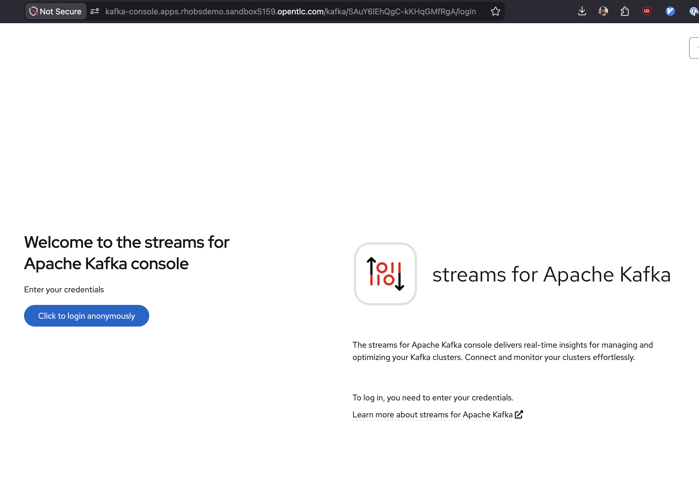

You'll be presented with an overview of the Kafka cluster that you created. Keep
this tab or window open, as we will return to it momentarily.

##### Create the observability signal topics

Finally, use the command below to create Kafka topics for our metrics, logs and
traces:

```sh
for t in metrics logs traces
do
  oc apply -f <<-EOF
apiVersion: kafka.strimzi.io/v1beta2
kind: KafkaTopic
metadata:
  name: "${t}-topic"
  namespace: rhobs-messaging
  labels:
    strimzi.io/cluster: kafka-cluster
spec:
  topicName: "${t}-topic"
EOF
done
```

Go back to the Kafka console, refresh the page, then click on "Topics."

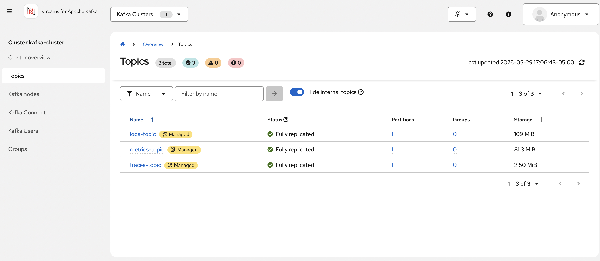

You should see three topics in the console. Click on any of them. You should see
messages appear in the topic momentarily. Keep refreshing to see them pile up!


#### Install Cluster Observability UI Plugins

Finally, we are going to use the Cluster Observability Operator to enable the
Signal Correlation feature as well as the "Traces" Observe tab in the Console.

Use the `oc` command below to create an `ObservabilityInstaller` instance:

```sh
oc apply -f - <<-EOF
apiVersion: observability.openshift.io/v1alpha1
kind: ObservabilityInstaller
metadata:
  name: rhobs
  namespace: openshift-observability
spec:
  capabilities:
    tracing:
      enabled: true
      operators:
        install: false
      storage:
        objectStorage:
          s3CCO:
            bucket: not-used
            region: us-east-2
EOF
```

> 📝 **NOTE**
>
> The Cluster Observabilty Operator is capable of provisioning Tempo and
> OpenTelemetry together. We are not taking advantage of this feature in our
> demo since our OpenTelemetry instance is using more advanced configuration to
> enable signals to be exported to multiple external systemms. Instead, we're
> purely using the `ObservabilityInstaller` resource above to enable the
> **Traces** view in the **Observe** section of the OpenShift Console.

Next, enable the logging, monitoring and troubleshooting UI plugins:

```sh
oc apply -f - <<-EOF
apiVersion: observability.openshift.io/v1alpha1
kind: UIPlugin
metadata:
  name: logging
spec:
  type: Logging
  logging:
    lokiStack:
      name: logging-loki
    logsLimit: 50
    timeout: 30s
    schema: otel
---
apiVersion: observability.openshift.io/v1alpha1
kind: UIPlugin
metadata:
  name: monitoring
spec:
  type: Monitoring
  monitoring:
    # This enables ACM features.
    acm:
      enabled: true
      alertmanager:
        url: "https://alertmanager.open-cluster-management-observability.svc:8443"
      thanosQuerier:
        url: "https://rbac-query-proxy.open-cluster-management-observability.svc:8443"
      # enables mapping alerts to components
    clusterHealthAnalyzer:
      enabled: true
---
apiVersion: observability.openshift.io/v1alpha1
kind: UIPlugin
metadata:
  name: troubleshooting-panel
spec:
  type: TroubleshootingPanel
EOF
```

Visit the OpenShift Console for your cluster. You might be asked to log in
again.

Click on **Observe**. You should now see **Traces** and **Logs** in the sidebar.

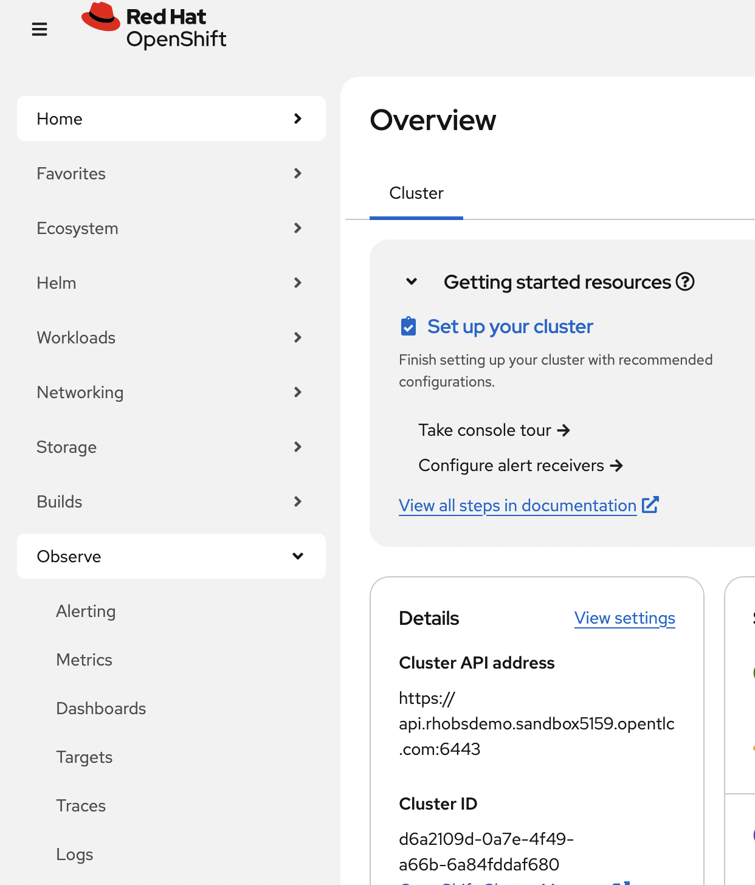

Click on the tiles to the left of the bell. You should see a "Signal
Correlation" tile in the dropdown.


🎉 Congratulations! You've configured the demo environment and are ready to
explore the demo provided in the [Demo](#demo) section!

## Demo

### Quickly observe cluster behavior with OpenShift Monitoring

OpenShift Monitoring is a built-in operator that accelerates MTTR and improves
platform reliability by automating monitoring cluster configuration using
opinionated defaults and providing visibility into cluster health right from the
OpenShift console.

Platform operators can quickly see how their clusters are doing by navigating to
the OpenShift Console and clicking on **Observe**, then **Metrics**.

After selecting any of the built-in queries, like _CPU Usage_, the Console
provides the traditional line graph you'd expect to see here.


The built-in monitoring stack is based on Prometheus, so you can create custom
queries with PromQL. Let's say we wanted to see how much memory the ArgoCD
instance that the OpenShift GitOps operator deployed is consuming. We can do
this by changing the query shown here to
`sum(container_memory_working_set_bytes{pod=~".*gitops.*"}) by (pod)`.


As we can see, our graph now changes to display memory consumption for our
ArgoCD application server instance.

That the `application-server` Pod is consuming much more memory than the others
is interesting. Let's copy the Pod name, visit the **Pods** view and search for
it.


Let's visit the "Signal Correlation" view in the Console tiles to see who and
what's related to this Pod.


