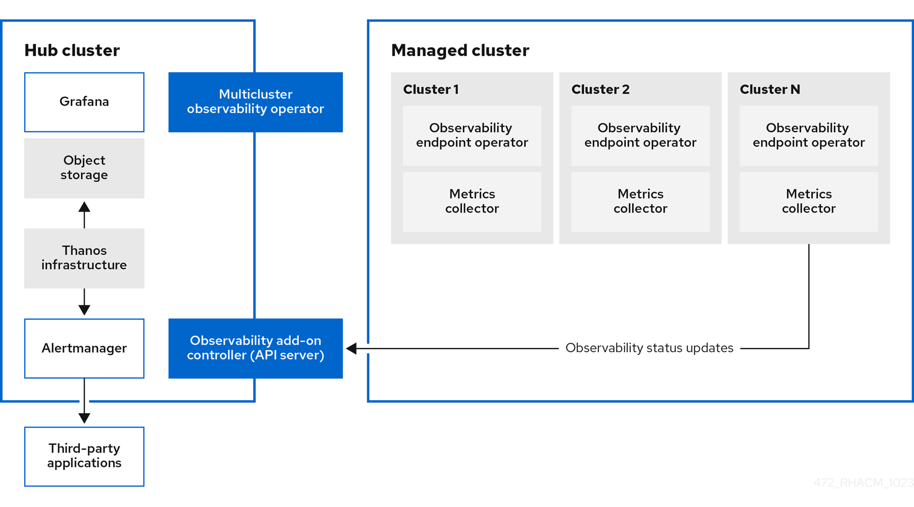

# Red Hat Multicluster Observability Demo

Understand platform-level behavior across all of your OpenShift clusters with
Advanced Cluster Management and Multicluster Observability.

<!-- vim-markdown-toc GFM -->

* [Three Key Points](#three-key-points)
* [Architecture](#architecture)
    * [Metrics](#metrics)
    * [Logs](#logs)
    * [Traces](#traces)
* [Setting Up](#setting-up)
    * [What You'll Need](#what-youll-need)
    * [Instructions](#instructions)
* [Demo](#demo)
    * [Visualizing cluster behavior with Grafana](#visualizing-cluster-behavior-with-grafana)
    * [Viewing automated right-sizing recommendations from ACM Observability](#viewing-automated-right-sizing-recommendations-from-acm-observability)
    * [Chatting with your infrastructure with OpenShift Lightspeed](#chatting-with-your-infrastructure-with-openshift-lightspeed)
* [Next Steps](#next-steps)

<!-- vim-markdown-toc -->

## Three Key Points

- Visualize behavior across multiple clusters with **Grafana** and
  **Prometheus** metrics aggregated by **Thanos**, all out of the box.
- Use `RightSizingRecommendation` resources to implement capacity management
  baselines.
- Chat with your observability platform with your favorite AI model with
  **OpenShift Lightspeed for ACM**.

## Architecture

> 🚧 **Work In Progress**
>
> This architecture image is from the ACM documentation. It will be updated as
> this environment is built out.

The resources provided in this demo create an end-to-end observability stack for
metrics, logs and traces across multiple OpenShift clusters viewable from ACM.

### Metrics

### Logs

### Traces

## Setting Up

### What You'll Need

- An AWS Account with an Access and Secret Key Pair and enough permissions to
  create an OpenShift cluster and an EKS cluster.
- The AWS CLI
- An OpenShift Cluster with ACM installed (tested with OpenShift v4.20 and ACM
  v2.17)
- Access to a shell, like `bash`, `zsh` or `fish`

> 📝 **NOTE**
>
> You can also use [Carlos's Demoland](https://github.com/carlosonunez-redhat/demoland) to spin up
> everything you'll need to run this demo in about 90 minutes. (45 minutes for
> the ACM hub and 45 minutes for the two clusters it will manage.)

### Instructions

> 🚧 **Work In Progress**
>
> This environment is being built out. Further instructions will become
> available once that's complete.

## Demo

You are a platform engineer that is responsible for multiple OpenShift and
Kubernetes clusters across your organization. Understanding how applications
interact with each other across and between these clusters is important.

While your organization has many products to help achieve this (Datadog, Splunk,
maybe even New Relic still), the bill for maintaining these services is only
getting more expensive.

There is an increasing appetite to roll a homegrown observability platform.
However, the thought of architecting, configuring and supporting all of the
tools you'll need to get this done --- Grafana, Prometheus, Thanos, Loki, OTel,
etc. --- is daunting, and that's before considering approvals from the
architecture review board or enterprise support options.

In addition to providing fleet management capabilities for OpenShift and
Kubernetes clusters, Advanced Cluster Management provides a simple way for
administrators to set up a production-level observability platform with minimal
overhead or toil. Everything that's shown in this demo comes out of the box and
can be configured from our documentation alone.

Let's take a closer look.

### Visualizing cluster behavior with Grafana

### Viewing automated right-sizing recommendations from ACM Observability

### Chatting with your infrastructure with OpenShift Lightspeed

## Next Steps
